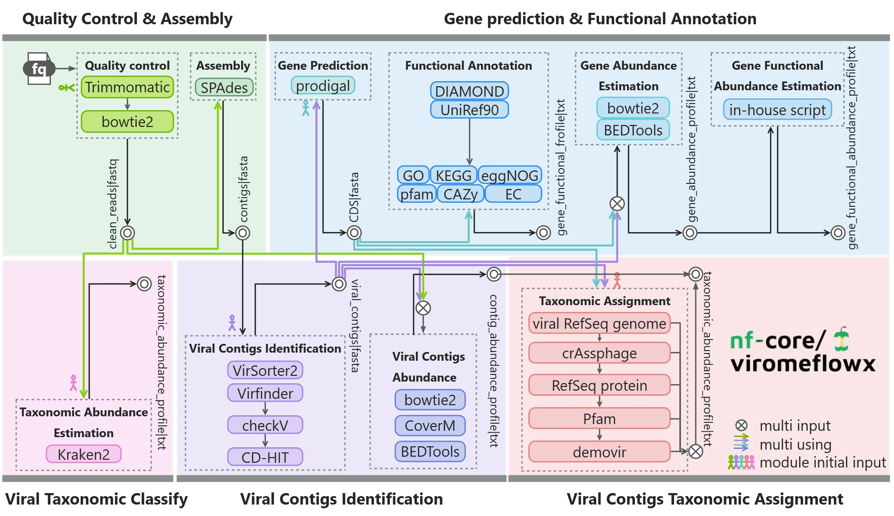

#  

[](https://nf-co.re/virome/results)[](https://doi.org/10.5281/zenodo.XXXXXXX)

[](https://www.nextflow.io/)
[](https://docs.conda.io/en/latest/)
[](https://www.docker.com/)
[](https://sylabs.io/docs/)
[](https://tower.nf/launch?pipeline=https://github.com/nf-core/virome)

[](https://nfcore.slack.com/channels/virome)[](https://twitter.com/nf_core)[](https://www.youtube.com/c/nf-core)

## Introduction

<!-- TODO nf-core: Write a 1-2 sentence summary of what data the pipeline is for and what it does -->

**ViromeFlowX** is a user-friendly Nextflow workflow that automates viral genome assembly, identification, classification, and annotation. This streamlined workflow integrates cutting-edge tools for processing raw sequencing data for taxonomic annotation and functional analysis. The pipeline enables efficient mining of viral genomic data, offering a valuable resource to investigate the gut virome's role in virus-host interactions and virus-related diseases.

<p align="center">
    
</p>

The pipeline is built using [Nextflow](https://www.nextflow.io), a workflow tool to run tasks across multiple compute infrastructures in a very portable manner. It uses Docker/Singularity containers making installation trivial and results highly reproducible. The [Nextflow DSL2](https://www.nextflow.io/docs/latest/dsl2.html) implementation of this pipeline uses one container per process which makes it much easier to maintain and update software dependencies. Where possible, these processes have been submitted to and installed from [nf-core/modules](https://github.com/nf-core/modules) in order to make them available to all nf-core pipelines, and to everyone within the Nextflow community!

<!-- TODO nf-core: Add full-sized test dataset and amend the paragraph below if applicable -->

On release, automated continuous integration tests run the pipeline on a full-sized dataset on the AWS cloud infrastructure. This ensures that the pipeline runs on AWS, has sensible resource allocation defaults set to run on real-world datasets, and permits the persistent storage of results to benchmark between pipeline releases and other analysis sources.The results obtained from the full-sized test can be viewed on the [nf-core website](https://nf-co.re/virome/results).

## Pipeline summary

<!-- TODO nf-core: Fill in short bullet-pointed list of the default steps in the pipeline -->

1. Quality Control ( [`trimmomatic`](https://github.com/usadellab/Trimmomatic) [`bowtie2`](https://github.com/BenLangmead/bowtie2) )
2. Assembly ( [`metaspades`](https://github.com/ablab/spades) )
3. Viral Taxonomic Classify ( [`Kraken2`](https://github.com/DerrickWood/kraken2) )
4. Viral Contigs Identification ( [`VirFinder`](https://github.com/jessieren/VirFinder) [`VirSorter2`](https://github.com/jiarong/VirSorter2) [`CheckV`](https://bitbucket.org/berkeleylab/checkv/src/master/) [`Cdhit`](https://github.com/weizhongli/cdhit) ) 
5. Gene Prediction & Functional Annotation ( [`Prodigal`](https://github.com/hyattpd/Prodigal) [`bedtools2`](https://github.com/arq5x/bedtools2) [`DIAMOND`](https://github.com/bbuchfink/diamond) )
6. Viral Taxonomic Classify Assignment ( [`usearch`](https://drive5.com/usearch) [`Blast`](https://blast.ncbi.nlm.nih.gov/Blast.cgi) [`taxonkit`](https://github.com/shenwei356/taxonkit) [`CoverM`](https://github.com/wwood/CoverM) )


## Quick Start

1. Install [`Nextflow`](https://www.nextflow.io/docs/latest/getstarted.html#installation) (`>=22.10.1`)

2. Install any of [`Docker`](https://docs.docker.com/engine/installation/), [`Singularity`](https://www.sylabs.io/guides/3.0/user-guide/) (you can follow [this tutorial](https://singularity-tutorial.github.io/01-installation/)), [`Podman`](https://podman.io/), [`Shifter`](https://nersc.gitlab.io/development/shifter/how-to-use/) or [`Charliecloud`](https://hpc.github.io/charliecloud/) for full pipeline reproducibility _(you can use [`Conda`](https://conda.io/miniconda.html) both to install Nextflow itself and also to manage software within pipelines. Please only use it within pipelines as a last resort; see [docs](https://nf-co.re/usage/configuration#basic-configuration-profiles))_. It is recommended to use [`mamba`(https://github.com/mamba-org/mamba)'] or [`Conda`](https://conda.io/miniconda.html) for installing and managing software of this pipeline.

3. Install the software dependencies of ViromeFlowX with the following command:

   ```bash
   mamba/conda env create -f /path/to/project/ViromeFlowX/environment.yml
   ```
   > Notes: The [`usearch`](http://www.drive5.com/usearch/) tool is not supported for installation through conda. You need to manually download and install it. Please refer to the official [`documentation`](http://www.drive5.com/usearch/manual/install.html) for installation instructions.

4. Download and configure the databases, please refer to the [`documentation`](https://github.com/01life/ViromeFlowX/blob/main/docs/database.md) for details

5. Download the pipeline and test it on a minimal dataset with a single command:

   ```bash
   nextflow run /path/to/project/ViromeFlowX -profile test,YOURPROFILE --outdir <OUTDIR>
   ```

   Note that some form of configuration will be needed so that Nextflow knows how to fetch the required software. This is usually done in the form of a config profile (`YOURPROFILE` in the example command above). You can chain multiple config profiles in a comma-separated string.

   > - The pipeline comes with config profiles called `docker`, `singularity`, `podman`, `shifter`, `charliecloud` and `conda` which instruct the pipeline to use the named tool for software management. For example, `-profile test,docker`.
   > - Please check [nf-core/configs](https://github.com/nf-core/configs#documentation) to see if a custom config file to run nf-core pipelines already exists for your Institute. If so, you can simply use `-profile <institute>` in your command. This will enable either `docker` or `singularity` and set the appropriate execution settings for your local compute environment.
   > - If you are using `singularity`, please use the [`nf-core download`](https://nf-co.re/tools/#downloading-pipelines-for-offline-use) command to download images first, before running the pipeline. Setting the [`NXF_SINGULARITY_CACHEDIR` or `singularity.cacheDir`](https://www.nextflow.io/docs/latest/singularity.html?#singularity-docker-hub) Nextflow options enables you to store and re-use the images from a central location for future pipeline runs.
   > - If you are using `conda`, it is highly recommended to use the [`NXF_CONDA_CACHEDIR` or `conda.cacheDir`](https://www.nextflow.io/docs/latest/conda.html) settings to store the environments in a central location for future pipeline runs.

6. Start running your own analysis!

   <!-- TODO nf-core: Update the example "typical command" below used to run the pipeline -->

   ```bash
   nextflow run /path/to/project/ViromeFlowX --input samplesheet.csv --outdir <OUTDIR> -profile <docker/singularity/podman/shifter/charliecloud/conda/institute>
   ```

## Documentation

The nf-core/virome pipeline comes with documentation about the pipeline [usage](docs/usage.md), [parameters](https://nf-co.re/pipeline_schema_builder?id=1685934039_c37b87cf4b3c) and [output](docs/output.md).

The pipeline will run QC -> Metaspades(min_len=1k) -> Identify(VirFinder、VirSorter2) -> Geneset -> Classify(demovir、pfam、protein、crAss、genome) -> Abundance
you can also use `--help` to see the parameters.

   ```bash
   nextflow run /path/to/project/ViromeFlowX --help
   ```

## Credits

nf-core/virome was originally written by 👩‍💻yangying.

We thank the following people for their extensive assistance in the development of this pipeline:
👨Xie hailiang
🧑Sun yingshuai
👩‍💻Liang lifeng
👨‍💻Xiao yang

<!-- TODO nf-core: If applicable, make list of people who have also contributed -->

## Contributions and Support

If you would like to contribute to this pipeline, please see the [contributing guidelines](.github/CONTRIBUTING.md).

For further information or help, don't hesitate to get in touch on the [Slack `#virome` channel](https://nfcore.slack.com/channels/virome) (you can join with [this invite](https://nf-co.re/join/slack)).

### :warning: Don't change the main master branch code directly, PLEASE create new branches and commit requirements!

## Citations

<!-- TODO nf-core: Add citation for pipeline after first release. Uncomment lines below and update Zenodo doi and badge at the top of this file. -->
<!-- If you use  nf-core/virome for your analysis, please cite it using the following doi: [10.5281/zenodo.XXXXXX](https://doi.org/10.5281/zenodo.XXXXXX) -->

<!-- TODO nf-core: Add bibliography of tools and data used in your pipeline -->

An extensive list of references for the tools used by the pipeline can be found in the [`CITATIONS.md`](CITATIONS.md) file.

You can cite the `nf-core` publication as follows:

> **The nf-core framework for community-curated bioinformatics pipelines.**
>
> Philip Ewels, Alexander Peltzer, Sven Fillinger, Harshil Patel, Johannes Alneberg, Andreas Wilm, Maxime Ulysse Garcia, Paolo Di Tommaso & Sven Nahnsen.
>
> _Nat Biotechnol._ 2020 Feb 13. doi: [10.1038/s41587-020-0439-x](https://dx.doi.org/10.1038/s41587-020-0439-x).
